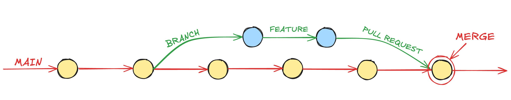
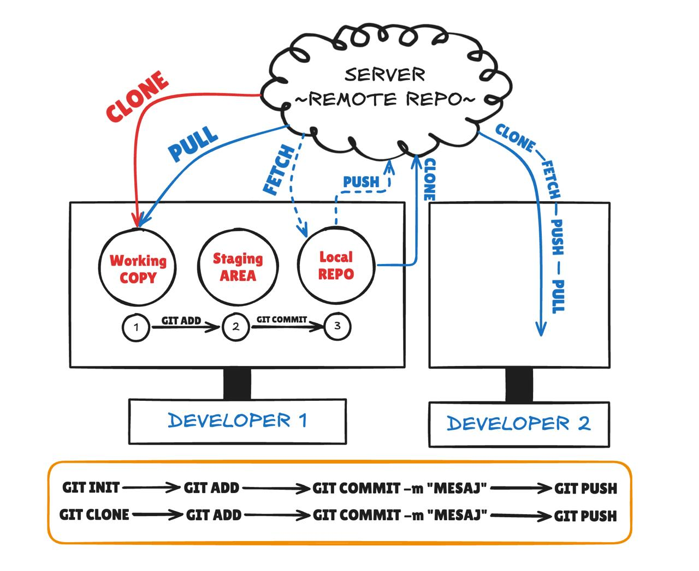
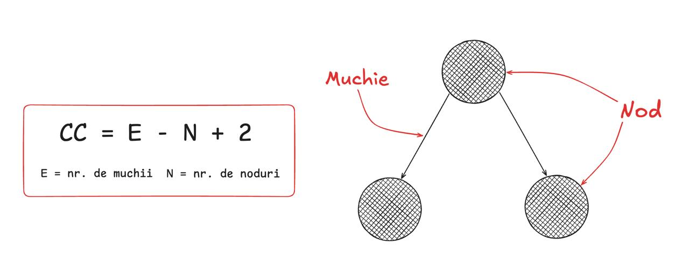

# Calitatea si testarea software
## Capitolul 1 - Versionarea (GIT)

### Terminologie versionare git:
- **VCS** = $${\color{orange}V\color{white}ersion\space\color{orange}C\color{white}ontrol\space\color{orange}S\color{white}ystem}$$
- **Repository** = $${\color{orange}serverul}$$ cu *ierarhia fisierelor* unde se pastreaza $${\color{red}toate\space\color{red}modificarile\space\color{red}proiectului}$$
- **checkout** = iei o copie a $${\color{orange}repository-ului}$$ tau de pe server si o aduci pe $${\color{red}calculatorul\space\color{red}tau\space\color{red}local}$$
- **working copy** = *versiunea locala* a proiectului de pe calculatorul tau
- **commit** = $${\color{orange}dupa\space\color{orange}ce\space\color{orange}faci\space\color{orange}modificarile}$$, *le publici* pe repository cu un mesaj $${\color{lightgreen}in\space\color{lightgreen}legatura\space\color{lightgreen}cu\space\color{lightgreen}codul\space\color{lightgreen}publicat\space\color{lightgreen}prin\space\color{lightgreen}acel\space\color{lightgreen}commit}$$
- **pull** = dupa ce *repository-ul de pe server* $${\color{red}sufera\space\color{red}modificari}$$, ca sa aduci proiectul de pe masina locala la zi, trebuie sa faci **pull**
- **conflict** = apare cand $${\color{red}2}$$ persoane lucreaza pe aceeasi bucata de cod.
- **merge** = combinarea modificarilor din 2 versiuni ($${\color{red}!\space exista\space\color{red}riscul\space\color{red}de\space\color{red}conflicte\space !}$$)
- **branch** = o *ramura separata* unde poti lua proiectul de pe ramura principala si sa *lucrezi la functionalitatea ta*.
- **revert** = $${\color{lightgreen}anularea\space\color{lightgreen}unui\space\color{lightgreen}commit\space\color{lightgreen}anterior.}$$
- **stash** = "*sertar*" unde poti depozita modificarile $${\color{lightblue}temporale}$$.
  

## Capitolul 2 - Clean Code
### Ce inseamna $${\color{red}Clean\space\color{lightgreen}Code}$$?
$${->un\space\color{lightgreen}set\space\color{lightgreen}de\space\color{lightgreen}principii\space\color{white}pentru\space\color{white} a\space\color{white} scrie \space\color{lightgreen}cod\space\color{lightgreen}usor\space\color{lightgreen}de\space\color{lightgreen}inteles\space,\space\color{lightgreen}usor\space\color{lightgreen}de\space\color{lightgreen}modificat\space\color{white} si\space\color{lightgreen}usor\space\color{lightgreen}de\space\color{lightgreen}citit.}$$
- **usor de inteles** = ordinea de executie este ${\color{red}logica}$ si bine ${\color{red}structurata}$, legaturile dintre elementele codului fiind evidente. ${\color{red}Rolul}$ fiecarei ${\color{red}clase}$, ${\color{red}functii}$, ${\color{red}metode}$ si ${\color{red}variabile}$ este imediat ${\color{red}inteles}$.
- **usor de modificat** = clasele si metodele sunt de mici dimensiuni, predictibile, disponibile public prin interfete bine documentate si au un singur task.

$${\color{red}\mathbf{! codul\ foloseste\ unit\ tests !}}$$

```diff
- Alte beneficii:
+ bug-urile pot fi identificate si rezolvate mai usor
+ toti programatorii vor intelege codul
```

###Principii:
- **DRY**$${\color{white}(\color{red}D\color{white}on't\space\color{orange}R\color{white}epeat\space\color{red}Y\color{white}ourself)}$$ = NU REPETAM ACCEEASI LOGICA IN MAI MULTE LOCURI!
- **KISS**(Keep It Simple and Stupid) = SCRIE CODUL SIMPLU SI CLAR, USOR DE RETINUT! (EVITA COMPLICATIILE INUTILE)
- **YAGNI**(You Ain't Gonna Need It) = NU SCRIE COD INUTIL (CARE NU E FOLOSIT)!
- **SOLID**:
1. Single Responsibility Principle (SRP) ~ Fiecare clasa si functie face un singur lucru BINE!
   EXEMPLU:
   **INAINTE**
```java
class Angajat{
  public void calculeazaSalariu(){ };
  public void salveazaBazaDeDate(){ };
  public void trimiteEmail(){ };
}
```
**DUPA** - Angajat nu ar trebui sa si calculeze salariul, salveze in baza de date si sa trimita emailuri!
```java
class Angajat{
  public void calculeazaSalariu(){ };
}
class ServiciuEmail{
  public void trimiteEmailSalariu(angajat){ };
}
```
2.Open-Closed Principle (OCP) ~ o clasa trebuie sa fie deschisa pentru extensie, dar inchisa pentru modificari!
EXEMPLU:
**INAINTE**
```java
class CalculatorReduceri{
  public void calculeaza(tipClient, pret){
    if(tipClient == "VIP"){
      return pret * 0.8; //20% reducere;
    } else if(tipClient == "Regular") {
      return pret * 0.95;
    } else if(tipClient == "Nou"){
      return pret;
    }
  }
}
```
**DUPA** - Adaugi reduceri noi fara sa modifici clasa existenta.
```java
abstract class StrategieReducere {
    public abstract double calculeaza(double pret);
}
class ReducereVip extends StrategieReducere {
  public void calculeaza(pret){
    return pret * 0.8;
  }
}
class ReducereRegular extends StrategieReducere {
  public void calculeaza(pret){
    return pret * 0.95;
  }
}
```
! prin a doua varianta putem adauga cate functionalitati ne dorim fara sa modificam clasa parinte.

3.Liskov Substitution Principle (LSP) ~ o clasa copil trebuie sa inlocuiasca clasa parinte fara sa strice comportamentul programul!
EXEMPLU:
**INAINTE**
```java
class Pasare{
  public void zboara(){
    System.out.println("Zboara!");
  }
}
class Pinguin extends Pasare{
  public void zboara(){
    throw new Error("Pinguinii nu zboara!");
  }
}
public void punePasareSaZboare(pasare){
  pasare.zboara(){ }; // pica la pinguin!
}
```
**DUPA**
```java
class Pasare{
  public void mananca(){
    System.out.println("Mananca seminte!");
  }
}
class PasareAlergatoare extends Pasare {
  public void alearga(){
    System.out.println("Alerg rapid!");
  }
}
class Pinguin extends Pasare {
  public void inoata() {
    System.out.println("Inoata!");
  }
}
```

4.Interface Segregation Principle (ISP) ~ Mai multe interfete specializabile sunt oricand de preferat unei singure interfete generale.

! Acest principiu sa nu fortezi clasele sa implementeze metode care nu au nevoie. E ca la restaurant, daca esti vegetarian, nu vrei sa fii fortat sa comanzi si carne.

EXEMPLU:
**INAINTE**
```java
// Interfata 1
class InterfataAngajat{
  public void munceste(){ };
  public void primesteSalariu(){ };
  public void conduceEchipa(){ }; // nu toti conduc echipe
  public void aprobaVacante(){ }; // nu toti aproba vacante
}

class Programator extends InterfataAngajat {
  public void munceste(){
    System.out.println("Scriu cod!");
  }
  public void primesteSalariu(){
    System.out.println("Primesc Salariu");
  }
  
  // Fortat sa implementeze desi nu e nevoie
  public void conduceEchipa(){
    throw new Error("Nu sunt manager!");
  }
  public void aprobaVacante(){
    throw new Error("Nu pot aproba vacante!");
  }
}
```
**DUPA**
```java
// Interfata 1
interface Muncitor{
  public void munceste(){ }
}
// Interfata 2
interface Salariat{
  public void primesteSalariu(){ }
}
// Interfata 3
interface Manager{
  public void conduceEchipa(){ }
  public void aprobaVacante(){ }
}
class Programator implements Muncitor, Salariat{
  public void munceste(){
    System.out.println("Scriu cod!");
  }
  public void primesteSalariu(){
    System.out.println("Primesc Salariu!");
  }
}
class Director implements Muncitor, Salariat, Manager{
  public void munceste(){ }
  public void primesteSalariu(){ }
  public void conduceEchipa(){ }
  public void aprobaVacante(){ }
}
```

5.Dependency Inversion Principle (DIP) ~ se introduce o abstractie de care depind ambele parti, pentru a facilita reutilizarea si a nu afecta modulelor high-level prin modificarea celor low-level. Modulele de nivel inalt nu trebuie sa depinda de module de nivel jos. Ambele trebuie sa depinda de abstractii.

EXEMPLU:
**INAINTE**
```java
class PayPal {
  public void plateste(double suma) {
      System.out.println("Achitat " + suma + " RON prin PayPal");
  }
}
// Clasa de nivel inalt depinde direct de PayPal
class Magazin {
    private PayPal procesorPlata;

    public Magazin() {
        this.procesorPlata = new PayPal(); // ❌ dependență directă
    }

    public void proceseazaComanda(double suma) {
        procesorPlata.plateste(suma);
    }
}
// X - TREBUIE SA MODIFICI MAGAZIN DACA VREI SA ADAUGI CEVA NOU (ex: Stripe) !!
```
**DUPA**
```java
// Interfata (abstractie)
interface ProcesorPlata {
    void proceseaza(double suma);
}
class PayPal implements ProcesorPlata {
    public void proceseaza(double suma) {
        System.out.println("Plata prin PayPal: " + suma + " RON");
    }
}
class Stripe implements ProcesorPlata {
    public void proceseaza(double suma) {
        System.out.println("Plata prin Stripe: " + suma + " RON");
    }
}
// depinde de abstractiune, nu de implementare
class Magazin {
    private ProcesorPlata procesorPlata;

    // Dependency Injection prin constructor
    public Magazin(ProcesorPlata procesorPlata) {
        this.procesorPlata = procesorPlata;
    }

    public void proceseazaComanda(double suma) {
        procesorPlata.proceseaza(suma);
    }
}
// Acum putem folosi orice procesator
public class Main {
    public static void main(String[] args) {
        Magazin magazinPayPal = new Magazin(new PayPal());
        magazinPayPal.proceseazaComanda(100);

        Magazin magazinStripe = new Magazin(new Stripe());
        magazinStripe.proceseazaComanda(200);
    }
}
```

- **Conventie de nume:**
  -> `UpperCamelCase` = fiecare cuvant incepe cu litera mare (ex: ContBancar, StatusComanda)
  -> `lpperCamelCase` = doar primul cuvant incepe cu litera mica, restul cuvintelor litera mare!

## Capitolul 2 - Unit Testing
### Ce este "Unit Testing"?
- o metoda de testare a codului inca din etapa de dezvoltare a produsului
- secventa de cod folosita pentru testarea oricarei bucati din produsul software se numeste "UNIT TESTING"
- testarea unitara este realizata de catre programatori
-----------------------------------------------------------------------------------------------------------------
#### 1. Testarea blackbox - metoda folosita de persoanele care nu cunosc arhitectura interna a aplicatiei testate
**Se folosesc datele de intrare si de iesire ale aplicatiei**
`Avantaje`:
- testele sunt realizate din perspectiva utilizatorului
- tester nu trebuie sa stie programare / limbajul folosit / structura aplicatiei
- testele sunt independente de dezvoltatori si au o perspectiva obiectiva.
  `Dezavantaje`:
- testele vor avea un numar mic de intrari
- testele pot fi inutile alaturi de alte teste facute de dezvoltator
- testerul nu are caietul de sarcini al aplicatiei, deci cazurile de testare sunt dificil de proiectat.
--------------------------------------------------------------------------------------------------------------
#### 2. Testarea whitebox - metoda folosita de persoanele care cunosc arhitectura interna a aplicatiei testate
`Avantaje`:
- testele se pot realiza in etapa incipienta a functionalitatii aplicatiei
- testarea este mai aprofundata, acoperind mai multe posibilitati
  `Dezavantaje`:
- testele fiind complexe, trebuie cineva calificat atat pe partea de programare cat si pe partea de cunoastere a software-ului
- intretinerea codului de testare poate fi o povara in cazul in care apar multe modificari in codul aplicatiei.
--------------------------------------------------------------------------------------------------------------
#### JUnit
- framework pentru testarea unitara a codului scris in JAVA.
- functioneaza conform 2 design pattern-uri: Composite si Command.
- clasa TestCase = obiect Command
- clasa TestSuite = mai multe instante TestCase sau TestSuite

`Concepte`:
1. **Fixture** - set de obiecte realizate in text
2. **Test Case** - o clasa ce defineste setul de obiecte (fixture) pentru a rula mai multe teste
3. **Setup** - o metoda / etapa de definire a setului de obiecte utilizate (fixture) inainte de testare
4. **Teardown** - o metoda / etapa de distrugere a obiectelor (fixture) dupa terminarea testelor
5. **Test Suite** - colectie de cazuri de testare (test cases)
6. **Test Runner** - instrument de rulare a testelor (test suite) si de afisare a rezultatelor

#### JUnit ASSERTIONS - "Checkpoint-uri" in teste, daca conditia nu e indeplinita testul pica si vezi unde este problema
- **assertEquals(expected, actual)** = verifica daca valorile `expected` si `actual` sunt egale
- **assertEquals(expected, actual, delta)** = delta e diferenta maxima dintre `expected` si `actual` pentru care numerele sunt considerate egale
- **assertSame(expected, actual)** = verifica daca `variabilele` fac referire la acelasi obiect.
- **assertNotSame(expected, actual)** = verifica daca `variabilele` nu fac referire la acelasi obiect.
- **assertNull(object)** = verifica daca obiectul e null
- **assertNotNull(object)** = verifica daca obiectul nu e null
- **assertTrue(condition)** = verifica daca conditia e adevarata
- **assertFalse(condition)** = verifica daca conditia e falsa
- **fail(message)** = pica la test si arunca `AssertionFailedError`, il folosim sa verificam daca exista o exceptie!
- **assertEquals(message, expected, actual)** = `message` este mesajul afisat daca pica testul
- **assertEquals(message, expected, actual, delta)**
- **assertSame(message, expected, actual)** = verifica daca variabilele fac referire la acelasi obiect, se afiseaza mesajul daca testul pica
- **assertNotSame(message, expected, actual)** = la fel ca `assertNotSame` doar ca are si mesaj
- **assertNull(message, object)** = la fel ca `assertNull` doar ca are si mesaj
- **assertNotNull(message, object)** = la fel ca `assertNotNull` doar ca are si mesaj
- **assertTrue(message, condition)** = la fel ca `assertTrue` doar ca are si mesaj
- **assertFalse(message, condition)** = la fel ca `assertFalse` doar ca are si mesaj
--------------------------------------------------------------------------------------------------------------
#### Right ~ B.I.C.E.P
- **RIGHT** = daca rezultatele furnizate de catre metoda sunt corecte.
- **B** = trebuie verificate toate limitele (Boundary) si daca in cazul acestor limite, rezultatele furnizate de metoda testata sunt de asemenea corecte.
- **I** = trebuie verificate relatiile inverse (Inverse)
- **C** = trebuie verificata corectitudinea printr-o verificare incrucisata (Cross-Check), folosind metode de calcule asemanatoare, testate si validate de catre o comunitate mare de programatori.
- **E** = trebuie simulata si fortata obtinerea erorilor (Errors) pentru verificarea comportamentului metodei in cazul anumitor erori.
- **P** = trebuie verificata pastrarea performantei (Performance) intre limitele acceptantei pentru produsul software final.

- `Inverse Relationship` = nu se aplica pentru toate metodele (deobicei se aplica celor matematice). Se porneste de la rezultate si se ajunge la aceleasi date initiale.
--------------------------------------------------------------------------------------------------------------
#### Boundary
- problemele apar la `"margini"` de intervale (limitele intervalelor)
- trebuie sa determini intervalul pentru valoarea parametrilor de intrare si intervalul de rezultate
- odata ce aceste limite au fost determinate, se efectueaza teste pentru aceste valori
- nu presupun testarea valorilor din afara acestor valori, ci verificarea corectitudinii acestor valori - valori limita.
- exista deobicei limite inferioare si limite superioare ~ testam ambele situatii
- pentru a identifica mai usor limite externe, utilizam principiul `CORRECT`
--------------------------------------------------------------------------------------------------------------
#### Cross-check
- pentru fiecare metoda, putem incerca sa o testam utilizand alta metoda.
- aceasta situatie este posibila cand metoda implementata (noua) a fost creata pentru productivitate sau daca metoda veche consuma prea multe resurse.
- testarea metodei noi se face prin metoda veche, chiar daca consumam mai mult.

```diff
- pentru a testa performanta (in JUnit4) si a verifica timpul in care ruleaza o anumita metoda, este folosita urmatoarea adnotare: @Test(timeout = 100) ✗
```
--------------------------------------------------------------------------------------------------------------
#### CORRECT:
- **C** = Conformance (conformitatea formatului)
- **O** = Order (ordinea)
- **R** = Range (intervalul)
- **R** = References (referinte externe)
- **E** = Existance (existenta obiectelor sau a rezultatelor)
- **C** = Cardinality (cardinalitatea rezultatelor)
- **T** = Time (timp)

*! Fiecare sub-principiu are o intrebare care ar trebui sa fie in mintea testerului !*

- `Conformance` = pentru orice intrare si iesire, trebuie sa se verifice `conformitatea` cu un format sau cu un standard.
- `Ordering` = in cazul listelor, trebuie sa verificam daca ordinea articolelor este cea dorita. De asemenea putem testa daca o metoda primeste parametri in ordinea dorita si returneaza rezultatele ordonate conform formatului proiectului.
- `Range` = pentru valoarea de intrare si iesire sunt setate anumite intervale care trebuie testate.
- `Reference` = anumite metode depind de lucruri externe sau de obiecte externe acestor metode. Aceste elemente trebuie controlate si verificate.
- `Existence` = trebuie sa testam daca aplicatia noastra are intotdeauna acces la parametri / internet / fisiere necesare. In caz contrar in loc sa pice aplicatia, utilizatorul trebuie avertizat cu privire la problema intampinata.
- `Cardinality` = similar cu testele de *Existance* (Existenta) si testele privind intervalul (Range). Verificam daca metoda / lista / colectia are 0 elemente / 1 element / n elemente. Daca functioneaza pentru 2/3/4 elemente, functioneaza si pentru mai multe.
- `Time` = similar cu testul de performanta *Right ~ BICEPS*. Similar cu design pattern-ul `TEMPLATE` (ex: pt. a apela metoda login() mai intai apelam conectare ()).
--------------------------------------------------------------------------------------------------------------
#### F.I.R.S.T
- **F**ast = testele trebuie sa fie rapide ca sa nu asteptam prea mult cand le rulam
- **I**solated/**I**ndependent = cand testul esueaza, acesta trebuie sa fie izolat si sa spuna exact unde este problema si ce problema exista.
- **R**epeatable = rezultatele obtinute trebuie sa fie identice indiferent de numarul rularilor.
- **S**elf-Validating = cand testele trec, dezvoltatorul ar trebui sa aiba incredere in cod, cand testele nu trec, metoda trebuie imbunatatita, nu e testul gresit.
- **T**imely = testele trebuie scrise la momentul potrivit in procesul de dezvoltare. Practic scrii testele inainte de dezvoltarea metodei pentru ghidare.
--------------------------------------------------------------------------------------------------------------
# Complexitatea ciclomatica

--------------------------------------------------------------------------------------------------------------
- **Dubluri de testare** = care inlocuiesc dependente reale in timpul testarii. Ca si dublurile de cascadori din filme (arata la fel, dar sunt folositi doar pentru scenele periculoase ~ testele)
  **Tipuri de dubluri:**
- `dummy object` = un obiect care respecta interfata dar metodele nu fac nimica.
- `stub` = similar ca dummy, doar ca metodele vor intoarce raspunsurile hardcodate / conservate.
- `spy` = este un stub care gestioneaza si controleaza numarul de apeluri.
- `fake` = un obiect similar cu unul real, dar are o versiune simplificata.
- `mock` = il folosim cand vrem sa controlam datele returnate de metoda si sa confirmam ca metoda e apelata cu valorile corecte ale parametrilor.